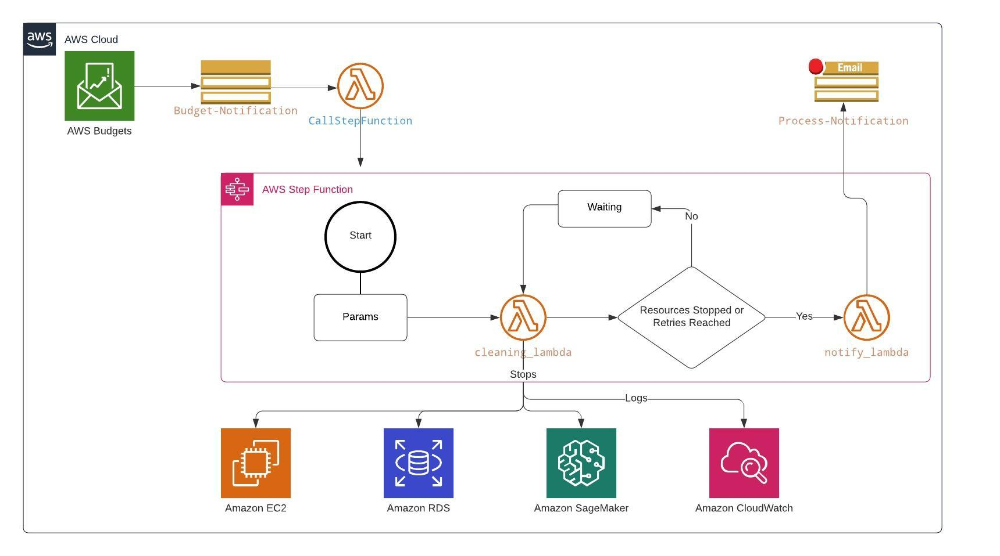

# LambdaSchool

This repository contains the template for the Lambda School project. This template is in charge of stopping EC2, RDS and SageMaker instaces when the estimated budget is reached.

## LambdaSchool Flowchart

  

### How it works?

The *AWS Budget* resource it's created to stablish a maximum amount of money that can be spent. When the cost of the resources exceed the 100% of the stablished budget, it would activate an *AWS SNS (Simple Notification Service)* to create a *Topic* and publish notifications in all the subscribers, in this case a *Lambda Function*. 

### Elements

* AWS Budgets: budget definition for the student, this will trigger an SNS Message to start the cleaning process

* Amazon SNS: SNS element that will publish a message to start the execution of the cleaning proccess

* State Machine: Lambda functions orchestration to start the process of stopping EC2, RDS and Sage Maker instaces.

* SNS and Email Notification: notification to the user about the results of the process.

## Infrastructure

The following template creates the following resources

  

* Budget-Notification: is an SNS Topic in charge of triggering the lambda to start the process

* CallStepFunction: Lambda function that starts the state machine execution.

* Cleaning_Lambda: Lambda function that lists Instances and tries to stop them. It also checks the state of the instaces.

* Notify_Lambda: Lambda function in charge of sending the notification about the process to the specified email address.

* Process-Notification: SNS Topic that publishes a message to the specified email address.

### Parameters

| Parameter        | Description           | Type    |
| ------------- |:-------------:| -----:|
| S3Bucket      | S3 Bucket where the template is hosted | String |
| WaitingTime | Time in minutes that will wait until retrying again (1 up to 15 minutes)      |    Number |
| EmailAddress | Email address to send notification when the cleaning process ends     |    Number |
| RetryTimes | The number of times the process will try to clean the resources if they are still running  |    Number |
| BudgetAmout | Budget amount that will trigger the clean up process, if the billing goes higher than the amount    |    Number |
| OwnerName   | Name of the owner of the resources, this will be used to tag resources that will be created | String
| StackName   | Name of the stack, this will be used to tag resources that will be created | String

