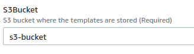
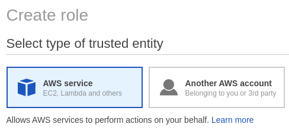

# LambdaSchool

This repository contains the template for the Lambda School project. This template is in charge of stopping EC2, RDS and SageMaker instaces when the estimated budget is reached.

## LambdaSchool Flowchart

  

* **AWS Budgets**: Allows the students define a budget. It sends a notification to all the subscribers when the cost of the other services exceed the 100% of the defined amount of money. This resource reset's the first day of everý month.

* **Amazon SNS**: Amazon Simple Notification Service creates a Topic and publish there, every resources subscribed to that Topic will receive a notification when the SNS get triggered.

* **Lamda Function and State Machine**: Lambda in charge of executing the process in the state machine (Step Functions). Step functionas are Lambda functions orchestration that starts the process of stopping EC2, RDS and Sage Maker instaces.

* **SNS and Email Notification**: SNS creates a Topic and all the resources subscribed can get a notification, in this the email given as a parameter to the template will receive a notification about results of the process.

* **AWS CloudWatch**: Lambda in charge of cleaning the resources sends logs to cloudwatch. This logs will be sent to the user as a cloudwatch link to see in detail the results of the process.

## Infrastructure

The template creates the following resources

  

* Budget-Notification: is an SNS Topic in charge of triggering the lambda to start the process

* CallStepFunction: Lambda function that starts the state machine execution.

* Cleaning_Lambda: Lambda function that lists Instances and tries to stop them. It also checks the state of the instaces.

* Notify_Lambda: Lambda function in charge of sending the notification about the process to the specified email address.

* Process-Notification: SNS Topic that publishes a message to the specified email address.

### Parameters

| Parameter        | Description           | Type    |
| ------------- |:-------------:| -----:|
| S3Bucket      | S3 Bucket where the template is hosted | String |
| WaitingTime | Time in seconds that will wait until retrying again      |    Number |
| EmailAddress | Email address to send notification when the cleaning process ends     |    Number |
| RetryTimes | The number of times the process will try to clean the resources if they are still running  |    Number |
| BudgetAmout | Budget amount that will trigger the clean up process, if the billing goes higher than the amount    |    Number |
| OwnerName   | Name of the owner of the resources, this will be used to tag resources that will be created | String
| StackName   | Name of the stack, this will be used to tag resources that will be created | String

* **Important:** When installing the template via cloudformation, it is necesary to confirm subscription that will be sent to the email provided in the parameters. This subscription is to receive the notification of the results of the process.

## Installation

### Using Launch Stack Template

1. Go to the installation link that will show Cloudformation's template installation wizard

2. Cloudformation's "Quick create Stack" will show, like the following

  

3. Go to the parameters section

  

  * BudgetAmount Parameter: This parameter will be the budget for your aws account, only numbers is allowed on this field. The following image is an example of creating a $10 budget. It is required. It is a montly budget that will be created
  

    
  

  * EmailAddress Parameter: This email address will be subscripted to receive notifications about the clean up process, provide a valid email address. It is required.
  

    
  

  * OwnerName Parameter: This parameter will be used to tag created resources by the stack. The purpose of this parameter is to identify who created the resources, choose an arbitrary name. It is required.
  

    
  

  * RetryTimes Parameter: This parameter describes the number of times the clean up process will run if there are resources still running. You can leave it as default. Do not leave it blank. It is required
  

    
  

  * S3Bucket Parameter: This parameter represents the S3 Bucket name where the nested templates are stored. It is required.
  

    
  

  * StackName Parameter: This parameter will be used to tag created resources by the stack. The purpose of this parameter is to identify the resources that belongs to this template. It is required.
  

    
  

  * WaitingTime Parameter: This parameter represents the waiting time between each retry. If resources are still running the process will wait the number of seconds you provide in this field. It is recommended to leave it as default. Do not provide a time lower than 300 seconds (5 min). It is required.
  

    
  

4. Go to the Capabilities section and check the capabilities boxes.

  

5. Click on the "Create Stack" Button.

  

6. After installation check your email (the one you provided on the parameters) and confirm subscription.

  

### Template Manual Installation

Use this installation guide if you do not have a launch template link.

#### Creating an S3 Bucket

1. Go to S3 service on your AWS Management Console

  

2. Create a new bucket, this bucket will host the Cloudformation template.

  

3. Enter a bucket name, this name will be used during the template's installation.

  

4. Choose a region for the bucket, remember you have to choose the same region where the Cloudformation template will be installed.

  

5. Click on the create button

  

6. Go to your new bucket and upload all the files from this repository. The bucket should look like this:

  

### IAM Role for Cloudformation

1. Go to IAM service on your AWS Management Console

  

2. Go to Roles and then click on "Create role" button

  

3. Under "Select type of trusted entity" section choose AWS service

  

4. Under "Choose a use case" section choose CloudFormation Service

  

5. Click on "Next" button and choose "AdministratorAcess" policy

  

6. Click on "Next" button and add a tag.

7. Click on "Next" button and give a name to your Role and click on "Create role"

  

### CloudFormation Template Installation

1. Go to S3 Bucket where you uploaded the template files and check the "master.yml" file to see its properties.

  

2. Copy the object URL and save it, this will be used during template installation.

  

3. Go to CloudFormation service on your AWS Management Console

  

4. Click on "Create Stack" button

  

5. Under "Amazon S3 URL" paste the object URL you saved before (master.yml file URL) and click "Next"

  

6. Give the stack a name and fill the parameters for the template. All parameters are required. After filling all parameters click on "Next"

  

* BudgetAmount Parameter: This parameter will be the budget for your aws account, only numbers is allowed on this field. The following image is an example of creating a $10 budget. It is required. It is a montly budget that will be created
  

    
  

  * EmailAddress Parameter: This email address will be subscripted to receive notifications about the clean up process, provide a valid email address. It is required.
  

    
  

  * OwnerName Parameter: This parameter will be used to tag created resources by the stack. The purpose of this parameter is to identify who created the resources, choose an arbitrary name. It is required.
  

    
  

  * RetryTimes Parameter: This parameter describes the number of times the clean up process will run if there are resources still running. You can leave it as default. Do not leave it blank. It is required
  

    
  

  * S3Bucket Parameter: This parameter represents the S3 Bucket name where the nested templates are stored. It is required. This S3 bucket is the one where the template files were uploaded.
  

    
  

  * StackName Parameter: This parameter will be used to tag created resources by the stack. The purpose of this parameter is to identify the resources that belongs to this template. It is required.
  

    
  

  * WaitingTime Parameter: This parameter represents the waiting time between each retry. If resources are still running the process will wait the number of seconds you provide in this field. It is recommended to leave it as default. Do not provide a time lower than 300 seconds (5 min). It is required.
  

    
  

7. Under "Configuer Stack Options" section you can add a tag if you want. Under "Permissions" section choose the IAM Role you created before. Click "Next"

  

8. Review screen will be shown, scroll down to the bottom of the page and check the capabilities options and click "Create Stack"

  

9. After installation check your email (the one you provided on the parameters) and confirm subscription.

  

