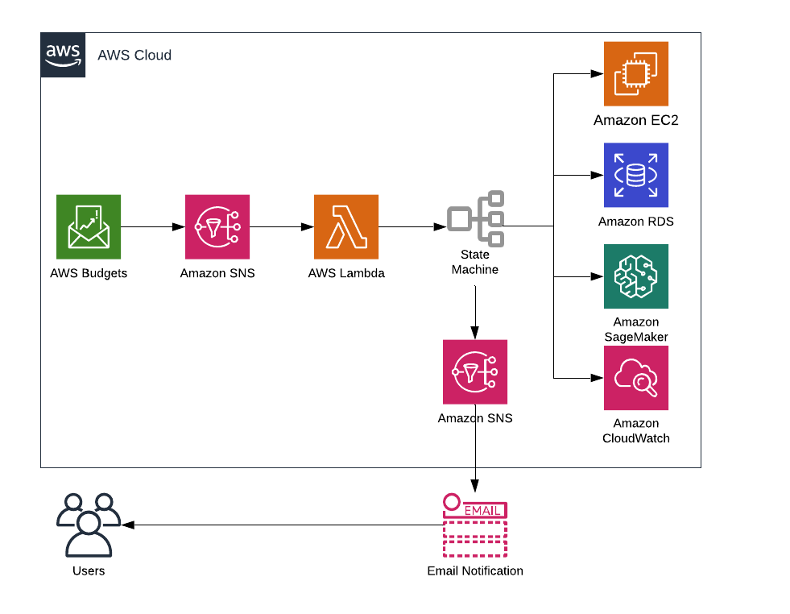

# LambdaSchool

This repository contains the template for the Lambda School project. This template is in charge of stopping EC2, RDS and SageMaker instaces when the estimated budget is reached.

## LambdaSchool Flowchart

  

* **AWS Budgets**: Allows the students define a budget. It sends a notification to all the subscribers when the cost of the other services exceed the 100% of the defined amount of money. This resource reset's the first day of everý month.

* **Amazon SNS**: Amazon Simple Notification Service creates a Topic and publish there, every resources subscribed to that Topic will receive a notification when the SNS get triggered.

* **Lamda Function and State Machine**: Lambda in charge of executing the process in the state machine (Step Functions). Step functionas are Lambda functions orchestration that starts the process of stopping EC2, RDS and Sage Maker instaces.

* **SNS and Email Notification**: SNS creates a Topic and all the resources subscribed can get a notification, in this the email given as a parameter to the template will receive a notification about results of the process.

* **AWS CloudWatch**: Lambda in charge of cleaning the resources sends logs to cloudwatch. This logs will be sent to the user as a cloudwatch link to see in detail the results of the process.

## Infrastructure

The template creates the following resources

  

* Budget-Notification: is an SNS Topic in charge of triggering the lambda to start the process

* CallStepFunction: Lambda function that starts the state machine execution.

* Cleaning_Lambda: Lambda function that lists Instances and tries to stop them. It also checks the state of the instaces.

* Notify_Lambda: Lambda function in charge of sending the notification about the process to the specified email address.

* Process-Notification: SNS Topic that publishes a message to the specified email address.

### Parameters

| Parameter        | Description           | Type    |
| ------------- |:-------------:| -----:|
| S3Bucket      | S3 Bucket where the template is hosted | String |
| WaitingTime | Time in seconds that will wait until retrying again      |    Number |
| EmailAddress | Email address to send notification when the cleaning process ends     |    Number |
| RetryTimes | The number of times the process will try to clean the resources if they are still running  |    Number |
| BudgetAmout | Budget amount that will trigger the clean up process, if the billing goes higher than the amount    |    Number |
| OwnerName   | Name of the owner of the resources, this will be used to tag resources that will be created | String
| StackName   | Name of the stack, this will be used to tag resources that will be created | String

* **Important:** When installing the template via cloudformation, it is necesary to confirm subscription that will be sent to the email provided in the parameters. This subscription is to receive the notification of the results of the process.